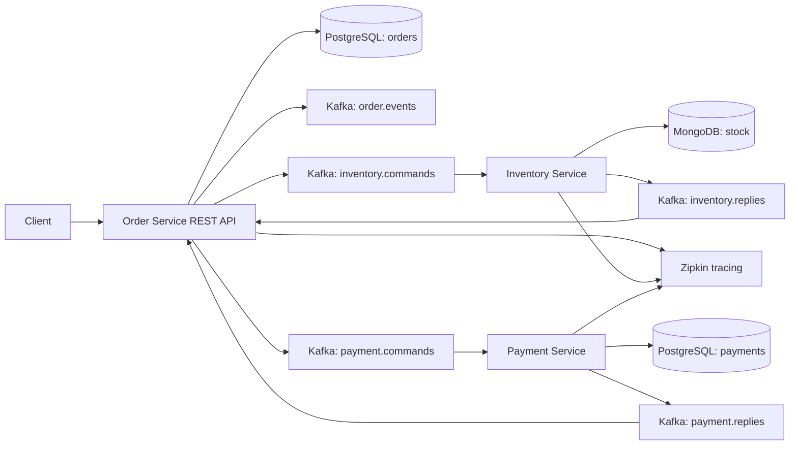

# Event-Driven E-Commerce Order Engine

A fault-tolerant Spring Boot microservices scaffold that separates Order, Inventory, and Payment domains. The Order service coordinates a saga through Kafka commands and replies, while Inventory and Payment own their own persistence.

## 🚀 Live Deployments


- **Order Service**: [https://order-service-4fge.onrender.com](https://order-service-4fge.onrender.com)

## Architecture



## Saga Flow

1. `POST /orders` creates a pending order.
2. Order service emits `OrderCreatedEvent` and sends `ReserveInventoryCommand`.
3. Inventory service reserves stock and replies with `InventoryReservedEvent` or `InventoryRejectedEvent`.
4. Order service sends `CapturePaymentCommand` after inventory is reserved.
5. Payment service replies with `PaymentCapturedEvent` or `PaymentRejectedEvent`.
6. Order service confirms the order, or rejects it and sends `ReleaseInventoryCommand` as compensation.

## Services

| Service | Port | Store | Responsibility |
| --- | --- | --- | --- |
| `order-service` | `8081` | PostgreSQL | REST API, order state, saga orchestration |
| `inventory-service` | `8082` | MongoDB | Stock reservation and release |
| `payment-service` | `8083` | PostgreSQL | Payment capture simulation |

## Run Locally

With Docker installed:

```bash
docker compose up --build
```

Create an order:

```bash
curl -X POST http://localhost:8081/orders \
  -H 'Content-Type: application/json' \
  -d '{
    "customerId": "11111111-1111-1111-1111-111111111111",
    "lines": [{"sku": "SKU-RED-SHIRT", "quantity": 2}],
    "total": {"amount": 59.98, "currency": "USD"}
  }'
```

Check the saga result:

```bash
curl http://localhost:8081/orders/<order-id>
```

Open Zipkin at `http://localhost:9411`.

## Kubernetes

The `k8s/` folder contains minimal deployments and services for Kafka, PostgreSQL, MongoDB, Zipkin, and the three application services:

```bash
kubectl apply -f k8s/
```

For production, replace the single-node data services with managed or HA deployments and add secrets, network policies, and externalized schema migrations.

# Event Driven E-Commerce Order Engine


## Saga Orchestration Flow
1. OrderCreated ➔ 2. ReserveInventory ➔ 3. ProcessPayment ➔ 4. OrderCompleted. Rejection triggers compensation pipelines.


## Kubernetes Guide
Run `kubectl apply -f k8s/` to spin up Kafka, PostgreSQL, and reactive services.


### Compensation state machine
Failure logs trigger direct rollbacks in Kafka.
